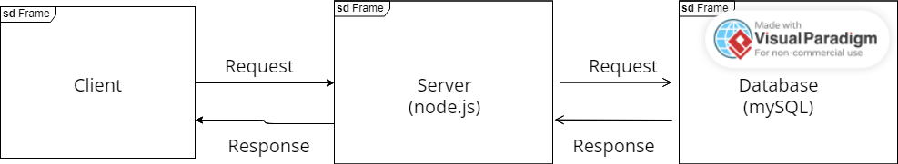

A. How to request data:
    """NOT HOSTED YET SO I NEED TO MAKE THE DATABSE PERMANENT"""
    
    1. Once hosted, I will link a url. it will be just a weburl. 
    2. If you want to run queries of the database, I would need your ip address until I figure out a way to make it public. 
    2a. if ip provided:
        Goto mysql workbench:
            -connecntion name:itinerary-386202:us-central1:places
            -host name: 34.170.99.60
            -port: 3306
            -username: test
            -password: root

B. How to receive data from the microservice:
    1. Add ip address to authorized network to access database
        -Please let me know what ipaddress to add. if you do not want to share it, I will figure something out
    2. Set up mysql socket:

User this code snippet: (database.js has this portion of my code)

    const mysql = require('mysql');

    var config = {
        user: process.env.DB_USER,
        database: process.env.DB_NAME,
        password: process.env.DB_PASS,
    };

    let connection = mysql.createConnection(config);

    connection.connect(function(err) {
    if (err) {
        console.error('Error connecting: ' + err.stack);
        return;
    }
    console.log('Connected as thread id: ' + connection.threadId);
    });

    module.exports = connection;
-----------------------------------------------------------------------------

and in an .env file, add this:

DB_HOST=34.170.99.60
DB_NAME=test_locations
DB_USER=test
DB_PASS=root

---------------------------------------------------------------------------

Once this is setup, you can run queries with this code snippet by changing the query parameter:

require('dotenv').config()
const express = require('express');
const app = express();
const bodyParser = require('body-parser');
const connection = require('./database');

app.get('/warehouses', (req, res) => {
  connection.query(
    "SELECT * FROM warehouses",
    (error, results, fields) => {
      if(error) throw error;
      res.json(results);
    }
  );
});

// Use port 8080 by default, unless configured differently in Google Cloud
const port = process.env.PORT
app.listen(port, () => {
   console.log(`App is running at: http://localhost:${port}`);
});

---------------------------------------------------------------------
